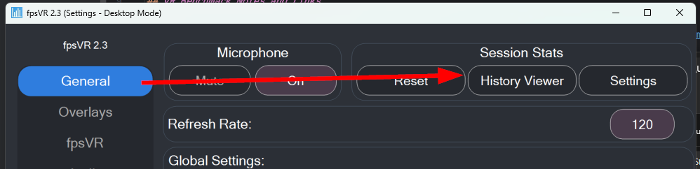
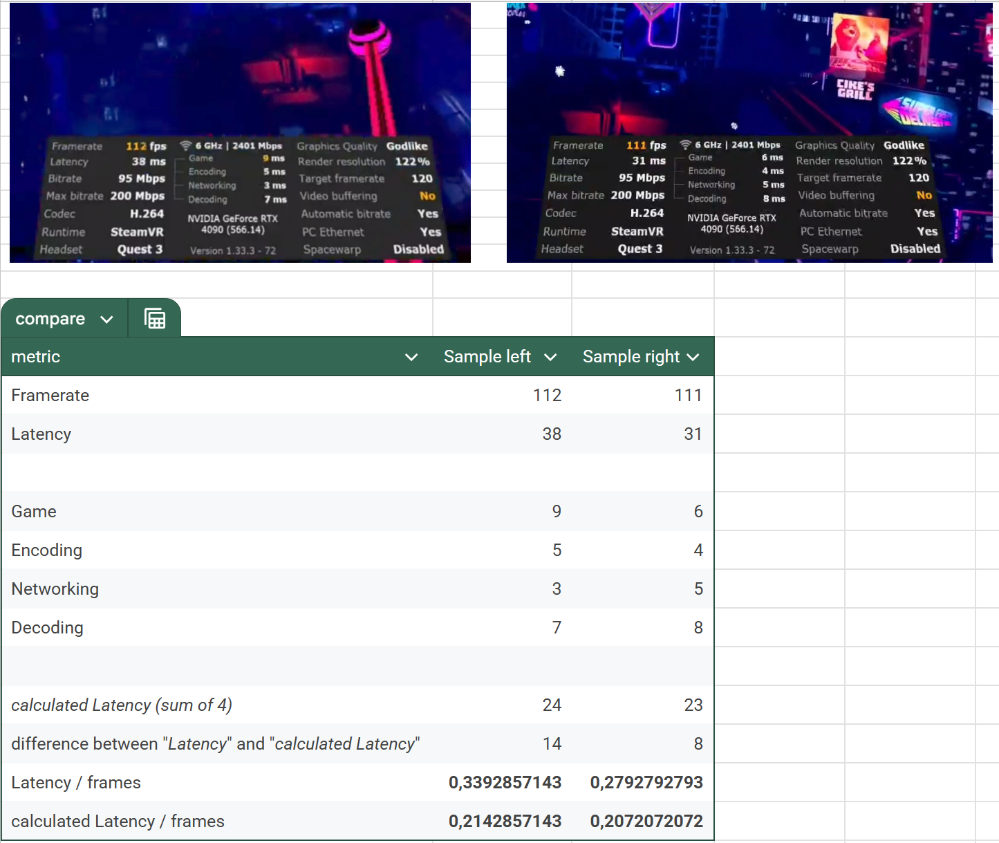

# VR Benchmarking

## Tools

!> not yet evaluated

- https://developer.imaginationtech.com/solutions/pvrtune/
- https://store.steampowered.com/app/908520/fpsVR/
- https://store.steampowered.com/app/955610/OpenVR_Benchmark/
- https://github.com/maluoi/openxr-explorer

## VR Benchmark Notes and Links

- giant list of tools:
    - https://github.com/authorTom/ultimate-XR-dev-guide/blob/main/README.md#performance-and-benchmarking
        - https://github.com/authorTom/notes-on-VR-performance
- https://mbucchia.github.io/OpenXR-Toolkit/other-features.html#record-statistics
- https://developers.meta.com/horizon/blog/ovr-metrics-tool-vrapi-what-do-these-metrics-mean/?locale=sv_SE
- https://www.reddit.com/r/ValveIndex/comments/134a50t/trying_to_understand_fpsvr_data_in_vr_sim_racing/#:~:text=fpsVR%20logging%20starts%20right%20when,the%20Options%20window%20of%20fpsVR.
- https://steamdb.info/patchnotes/6447148/

## Specific Tools

## fpsVR - Recorde every Session

fpsVR records performance metrics for every session and ships with a viewer.

Stored here: `C:\Users\<Username>\Documents\fpsVR`

- https://store.steampowered.com/app/908520/fpsVR/

### Virtual Desktop - Latency Figures in the Performance Overlay

The performance overlay in Virtual Desktop is the most popular way to get latency figures.  
It's also the most cited source for latency figures on Reddit... **BUT:**

!> The latency figures are 100% reproducible and consistent. So 1:1 comparison, even within the same setup, is not 100% accurate.

!> Thus the values given in online discussions can't really be used as a reference for your own setup.

Latency Figures in the Performance Overlay:

- Game is your computer's CPU/GPU rendering the game
- Encoding is your GPU encoding the video
- Networking is your router and network
- Decoding is the headset GPU decoding the image

According to their Discord, these numbers include other Latencies as well, which aren't shown and known.  
The developers don't want/can't add a detailed logging output, so keep in mind that the values are not accurate by the ms.  
Which means: don't trust the numbers you read on Reddit :/

I've made this comparison to show that the latency figures are not constant:

