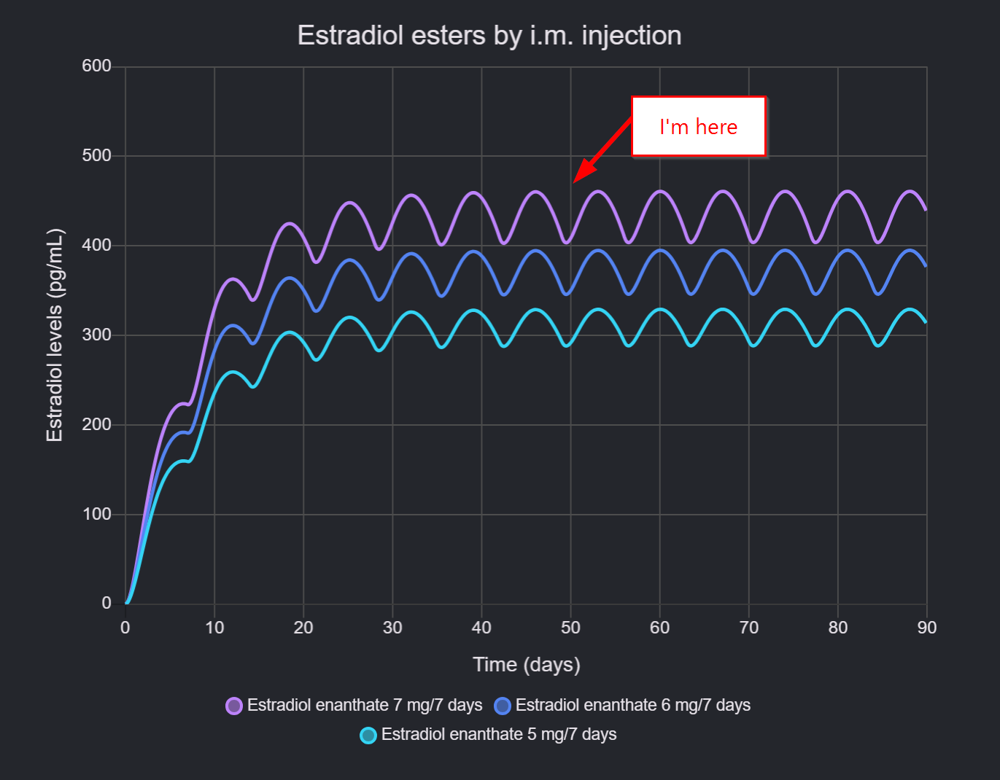

# HRT(E) Journal - Notes and Thoughts from a Journey into Unknown Territories

## Intro and Disclaimer

I'm a big fan of putting the same kind of stuff into the same place(e.g. one todo app for all todos instead of multiple tools + notebooks), so I've decided to put my notes and thoughts about trying HRT here.
I do have an offline journal where I put in unfinished thoughts and stuff - but my goal is to put finished thoughts and knowledge here - for myself to come back to from anywhere at any time and because information exist to be shared<3

## Prologue

### Phase 1 - Understanding my own Thoughts and Feelings

### Phase 2 - The Point of No Return

#### 01.03.2024 - F1NN5TER rewired my brain

01.03.2024 F1NN5TER came out as Genderfluid. I came across the livestream on pure accident while browsing reddit sorted by new.
What rewired my brain was when Finn said that he _just went to take HRT to see and find out what and if it changes anything_ in combination with the fact that he doesn't identify as a woman, but just as fluid/gender of the day.
It hit different from all the other stories I've read and heard about - I think because it was a livestream and not a video.

Video of the stream + commentary by F1NN5TER: https://www.youtube.com/watch?v=R8t5TL_1aLc

This realization stuck with me for the following days.

#### 02.03.2024 - Realizing HRT(E) is cheaper than a Netflix subscription

This was the first time I've seriously looked into DIY HRT and realized that 1 year worth of Estradiol is around 60-80€.
There are a few things that go on top - especially the initial blood test that should be more comprehensive than the following - but for people with an average income, the costs aren't anything to worry about.

And unlike Testosterone, it's not illegal to buy nor an issue at customs when bought from within EU, so the whole topic of Estradiol felt like nothing to worry about.

#### 04.03.2024 - F1NN5TER rewired my brain - Part 2 - I'm not hating my body, I just don't have a connection to it

From my diary:

> [...]... also ich hasse meinen Körper ja nicht - ich hab nur keine Connection dazu.
> Und ich seh mich gar nicht unbedingt komplett als Frau[...], sondern ich will mich nur fühlen, wie ich mich sehe und mich beschreibe.
> Ich will vor allem, dass ich eine physische Identität habe.
> Das ich mich fühle und wenn ich in den Spiegel sehe schaue und denke "oh, das bin ich".

#### 05.03.2024 - The big plan and setting a deadline

### Phase 3 - Realizing that I have a body and it is mine

I guess this phase started with Phase 1 already, but according to my diary `05.03.2024` was the day I wrote this:

> Ich will meinen Körper und Geist zusammenbringen.
> Mich im Spiegel sehen und mich sehen.

In combination with the realization that I've always been fascinated by piercings and tattoos, but a weird hesitation to get them myself.This day I realized:

> Wenn mir die _Leinwand_ nicht gefällt, dann bringt eine so _kleine_ Änderung nichts.
> Wahrscheinlich sollte ich die Leinwand mal ändern.

Of course, I don't see the point of getting a tattoos or piercings on a body that I don't feel connected. It's like decorating someone else's home.

At this point, I've decided to start HRT till the end of the year.
A lot has happened the rest of the year. Work got super chaotic. But I also experimented with tattooing myself. I think this changed my view on my body a lot. It wasn't even the big bang I've expected. I think because the big change in my mind already happened with the decision
to set everything up
to do it.
The moment I finished the first tiny star, I just continued with a few more - it immediately felt like the right thing to do.
My body became mine.

## Checkpoints, Milestones and Check-ins

### Week -1 - Ordering everything to be ready for the day I feel ready for it

Knowing myself, I know that I should have everything ready and in place for the moment I feel ready to start. My ADHD brain gets into a very weird mode the moment it decides to be ready to do something.It's not even that much that is needed:

- Estradiol
- Needles and Syringes
- Alcohol swabs
- A sharps container
- Blood test

#### Estradiol

I added a bit more details into my notes here: [trans(-fem) stuff:3](README.md)

Tl;dr:

- I went with [Estradiol Enanthate(EEn) 50mg/ml](https://voixceleste.cc/p/estradiol-enanthate-500/)
- For getting and sending Crypto: https://www.bitcoin.de/
    - I used Litecoin to pay. It took less than 2 hours from buying, receiving, sending and getting the payment confirmed.

#### Needles and Syringes

The only thing that takes a bit of research to figure out that to go with is the needles and syringes.
It depends on the kind of Estradiol(different kind of oil[grapeseed] can be easier to inject with thicker needles), method of injection(subcutaneous vs intramuscular), cost and what kind of scale you want/need to go with.

I went with the variant that seems to be the simplest: BD MICRO-FINE+ Insulinspritzen 1 ml U100 12,7 mm

- cost around 20€ for 100
- the U100 scale makes it super easy to measure the dosage
- comes with the needle attached - safes a bit of handling and time

They are available in all online pharmacies like:

- https://www.shop-apotheke.com/arzneimittel/4400162/bd-micro-fine-u-100-insulinspritzen-12-7-mm.htm
- https://www.sanicare.de/p/bd-micro-fine-insulinspritzen-1-ml-u100-12-7-mm-100x1-spritzen-04400162

#### Alcohol swabs

Noting to say here. Just got the cheapest

#### A sharps container

When getting the BD MICRO-FINE+ remember that the container needs to be big enough to fit the whole Syringe + Needle.

#### Blood test

(todo)

- https://www.meindirektlabor.de/standorte/

### Day 0 - 20.01.2025 - Blood tests and getting results too fast to plan

Went to the lab in the morning and forgot something important: plan the next steps.
Because I didn't expect the results to be ready the SAME day.
Ok, I paid 200€ for the tests... but didn't expect them to be ready at 16pm.

I took the rest of the day to read up on dosage and how to choose the right day...
After reading so many stories about being emotional and unstable, I decided to go with Wednesday or Thursday, to not have an emotional breakdown at work or at least could flee into homeoffice.

### Week 1 - 21.01.2025 - Preparing for the big cry

- Dosage: Mid (7 mg/week); 0.14 ml or 14 Units of the U100 Scale.
- Time: 09:05

After debating with myself and ChatGPT, I decided to just go for it immediately instead of waiting for an arbitrarily "better" day. Exactly how I planned the whole thing - have everything ready to start the moment I feel ready. And this moment was now!

The rest of the week went super uneventful. I was so prepared for the big cry, but nothing happened :D
I felt just a tiny bit relaxed.

### Week 2 - 28.01.2025 - A new kind of happiness

- Dosage: Mid (7 mg/week); 0.14 ml or 14 Units of the U100 Scale.
- Time: 08:00

Week two I slowly felt like the slight increase in happiness is consistent and noticable - I started to smile every time I looked into the mirror.

#### Sunday - 02.02.2025 - Sudden physical changes: My skin isn't oily, it's just softer?!!

At the end of a lazy weekend - 2 days of not shaving and showering(oops) - I suddenly realize that my skin doesn't feel the usual kind of _soft_ it becomes after 2 of these days.
It's a different kind of soft. It's soft without being greasy and oily. It's just soft.

omg. It's happening.

### Week 3 - 04.02.2025 - I might need to buy longer barbells for my nipple piercings quite soon

- Dosage: Mid (7 mg/week); 0.14 ml or 14 Units of the U100 Scale.
- Time: 07:00

Is it the nipple piercings that got infected or the HRT?
Ok, sorry babe, but they should be healed by now.
Physical changes are happening.
omg.

### Week 4 - 11.02.2025 - I've joined the "Am I am just getting fatter or is the HRT working?" game

- Dosage: Mid (7 mg/week); 0.14 ml or 14 Units of the U100 Scale.
- Time: 07:00

Friday 21.02.: After _rotting_ for a two days in homeoffice and in the same clothes, I got really confused seeing myself shirtless in the mirror.
I'm still not sure. But... there might be something happening.

This week I also started to like my appearance more and more - like HRT added the thing that I was missing before: I didn't feel like I'm faking it, like before. Yes, the bra still felt a bit weird and _too much_, but even that in a different way than before.
hui.

### Week 5 - 18.02.2025

- Dosage: Mid (7 mg/week); 0.14 ml or 14 Units of the U100 Scale.
- Time: 10:00

Still went with 7mg/week even though I thought about lowering to 5mg/week because I've read that the spike might be to high with 7mg/week.. but I probably wait till the first follow-up blood test and decide then(somewhere in the next weeks).
It also feels like my body hair - that I treated with IPL for the past years - is currently growing back faster than I'm used to(I reduced it to _every few months_ without much regrowth).
It is something expected to happen, triggered by second puberty. I'll see how it goes and probably start doing IPL regularly again.

### Week 6 - 25.02.2025

- Dosage: Mid (7 mg/week); 0.14 ml or 14 Units of the U100 Scale.
- Time: 09:00
- changes

    - Felt a little meh the whole week - probably because of the weather and a light cold.
    - First week I didn't feel a specific change - more neutral.
- hair/skin

    - Had rather itchy legs. Don't know if it's related to E. Got a bit better after shaving.
- clothes/fashion

    - didn't wear specific feminine clothes the whole week(even at home). Just didn't feel like it. Something that felt rather unusual, but not bad.

### Week 7 - 04.03.2025

- Dosage: Mid (7 mg/week); 0.14 ml or 14 Units of the U100 Scale.
- Time: 07:00

notes:

- Felt way better monday(lowest E day) and tuesday(day of the injection) than the whole week before. Can have lots of reasons I guess.
- made an appointment to get blood work done on the 10th of May. (It's recommended to do it on the day of the lowest E level - so the day before the next injection)

changes:

- none really. I've swapped the piercings to longer barbells(+2 and +4mm) which feels much better now.

### Week 8 minus 1 Day - 10.03.2025 (Blood test after 50 days)

Did a blood test after 50 days. The day before the next injection - so should be the day with the lowest E level:

|                   | day 0       | day 50     |
|-------------------|-------------|------------|
| T                 | 5,44 ng/ml  | 0,27 ng/ml |
| E2                | 33 pg/ml    | 481 pg/ml  |
| DHT(german: SHBG) | 44,7 nmol/l | 111 nmol/l |
| Prolactin         | 13,3 µg/l   | 26,6 μg/l  |

The results seem to be as expected(yahi!🥳🙃🤸).  
I knew I'd overshoot the E2 levels with 7mg/week, but I didn't want to change the dosage before the first blood test.  
I'll lower the dosage to 6mg/week for this week and to 5mg/week for the next weeks (to not have a _"hard"_ drop from 7 to 5) and will take another test in about 4 weeks.  
This should give a good indication whether to stay on 5mg/week or 6mg/week.

For reference the chart from the simulator:

Link to chart: https://advsim.transfemscience.org/?r=3&e=444&d1=7&d2=6&d3=5&ra=333&i1=7&dl1=&i2=7&dl2=&i3=7&dl3=&s=0&h=0&xm=90&ym=600

### Week 8 - 11.03.2025

- Dosage: Mid (6 mg/week); 0.12 ml or 12 Units of the U100 Scale.
- Time: 09:00
